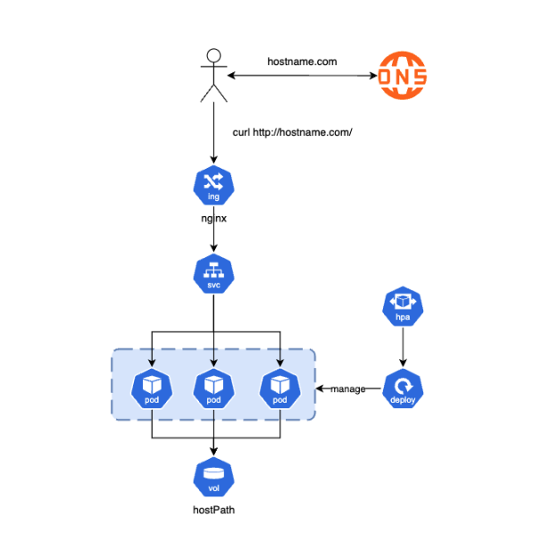

# Deploying and Accessing Your Application Using Ingress with Minikube

This `README.md` explains how to set up your application with **Ingress** in a Minikube cluster, troubleshoot potential issues, and test its functionality.



---

## **Prerequisites**

Before starting, ensure you have the following installed and configured:

1. **Minikube**: A local Kubernetes cluster.
   - Install: [Minikube Installation Guide](https://minikube.sigs.k8s.io/docs/start/).
2. **kubectl**: Kubernetes command-line tool.
   - Install: [kubectl Installation Guide](https://kubernetes.io/docs/tasks/tools/).
3. **Helm**: Kubernetes package manager.
   - Install: [Helm Installation Guide](https://helm.sh/docs/intro/install/).

---

## **Steps**

### 1. Start Minikube
Start your Minikube cluster:
```bash
minikube start
```

### 2. Enable the Ingress Add-on
Enable the NGINX Ingress Controller provided by Minikube:
```bash
minikube addons enable ingress
```

Verify that the Ingress Controller is running:
```bash
kubectl get pods -n ingress-nginx
```
Expected output should show the `ingress-nginx-controller` pod in a `Running` state.

### 3. Create a Helm Chart for Your Application
Create a Helm chart for your application:
```bash
helm create my-app
```

Replace the `ingress.yaml` and `values.yaml` in your Helm chart with the provided configuration.

### 4. Update `/etc/hosts`
Get the Minikube IP:
```bash
minikube ip
```
Map the Local IP to your application hostname in `/etc/hosts`:
```plaintext
127.0.0.1 hostname.com
```

### 5. Deploy Your Helm Chart
Deploy your application using Helm:
```bash
helm install my-app ./my-app --values ./my-app/values.yaml
```

### 6. Verify the Deployment
1. Check the pods:
   ```bash
   kubectl get pods
   ```
   Ensure all pods are in the `Running` state.

2. Check the service:
   ```bash
   kubectl get svc
   ```

3. Verify the Ingress:
   ```bash
   kubectl get ingress
   ```
   The `ADDRESS` column should show the Minikube IP.

### 7. Test the Application
- Access the application in your browser:
  ```plaintext
  http://hostname.com
  ```
- Or test using `curl`:
  ```bash
  curl http://hostname.com
  ```

---

## **Troubleshooting**

### Issue: `EXTERNAL-IP` Shows `<pending>` for `ingress-nginx-controller`
**Solution:** Use the Minikube tunnel to simulate a LoadBalancer:
1. Start the tunnel:
   ```bash
   minikube tunnel
   ```
2. Check the service again:
   ```bash
   kubectl get svc -n ingress-nginx
   ```
3. Update `/etc/hosts` with the new external IP.

### Issue: Cannot Access the Application via Hostname
**Solution:**
1. Verify that `/etc/hosts` correctly maps the Minikube IP to `my-app.local`.
2. Ensure the `Ingress` resource is correctly configured:
   ```bash
   kubectl describe ingress my-app
   ```
3. Check the NGINX Ingress logs for errors:
   ```bash
   kubectl logs -n ingress-nginx -l app.kubernetes.io/name=ingress-nginx
   ```

---

## **How It Works**

1. **Ingress Controller**:
   - The Ingress Controller is a component that manages HTTP(S) traffic routing for your Kubernetes cluster.
   - In this setup, Minikube uses the NGINX Ingress Controller.

2. **Ingress Resource**:
   - The `Ingress` resource defines rules for routing requests to Kubernetes services based on hostnames (e.g., `my-app.local`) and paths (e.g., `/`).

3. **Service**:
   - The `my-app` service exposes your application pods within the cluster on port 80.

4. **Minikube Tunnel**:
   - The `minikube tunnel` command creates a LoadBalancer simulation, assigning an external IP to the `ingress-nginx-controller`.

5. **Routing**:
   - Traffic sent to `my-app.local` is routed to the NGINX Ingress Controller.
   - The controller forwards the request to the `my-app` service, which then routes it to the appropriate pod.

---

## **Directory Structure**

Here’s the final directory structure of your Helm chart:

```
my-app/
├── charts/
├── templates/
│   ├── deployment.yaml
│   ├── service.yaml
│   ├── ingress.yaml
│   ├── storage.yaml
│   ├── hpa.yaml
│   └── _helpers.tpl
├── values.yaml
├── Chart.yaml
└── README.md
```

---


## **Conclusion**

You have successfully deployed your application using Ingress in a Minikube cluster! If you face any issues, refer to the troubleshooting section or logs for debugging.

Let me know if you need further clarification! 🚀
